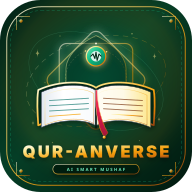

# 🌟 QURANVERSE — AI Guru Ngaji Pribadi No. 1
> **The Ultimate Islamic AI Platform for Qur'an Reading, Muroja'ah & Real-time Tajwid Evaluation.**



---

## 🕋 Tentang QURANVERSE
**QURANVERSE** adalah platform mobile-web & PWA premium berestetika **Islamic Neobrutalism** yang dirancang untuk membantu umat Islam membaca Al-Qur'an 30 Juz dengan Rasm Utsmani, melatih dan menguji hafalan (*muroja'ah*) menggunakan **AI Speech Recognition**, mengoreksi makhraj & tajwid dengan adab santun islami, serta menyediakan jadwal shalat dan adzan otomatis presisi Kota Makassar.

Lantunan audio ayat dan adzan dibawakan secara eksklusif oleh **Syekh Misyari Rasyid Al-Afasi**.

---

## ✨ Fitur Utama

1. **📖 Mode Mushaf Al-Qur'an 30 Juz (Rasm Utsmani):**
   - 114 Surat & 30 Juz lengkap berstandar Kemenag RI.
   - **Arti Kata per Kata (Word-by-Word):** Klik kata Arab untuk melihat arti, transliterasi, dan akar kata.
   - Audio per ayat dari **Syekh Misyari Rasyid Al-Afasi** dengan floating player bar.
   - Slider ukuran font Arab, 3 tema (*Krem Mushaf, Zamrud, Malam*), bookmark, dan catatan tadabbur.

2. **🎙️ Muroja'ah Real-Time + Koreksi AI Cerdas:**
   - Soal surat & ayat disajikan secara **ACAK** dari 30 juz (atau filter per Juz / Surat).
   - Teks ayat Al-Qur'an terpampang jelas di layar sebagai panduan.
   - Perekam suara via mic dengan visualizer gelombang audio retro-neobrutalis.
   - **Penanda Kata Salah & Benar:** *Hijau (Fasih/Benar)*, *Kuning (Kurang Tepat)*, *Merah (Salah/Terlewat)*.
   - **Adab Santun AI:** Memuji terlebih dahulu sebelum mengoreksi dengan lembut.
   - **Audio Contoh Syekh:** Otomatis memutarkan bacaan fasih Syekh Misyari saat bacaan keliru.
   - **Wajib Ulang:** Skor minimal **&ge; 80%** untuk lulus ke ayat berikutnya.

3. **🙈 Mode Simai Tutup Mata (Lanjutan Lisan):**
   - Suasana kaligrafi islami gelap dengan teks ayat besar di tengah layar.
   - Putar audio ayat Syekh Misyari acak &rarr; User menyambung ayat berikutnya secara lisan via mic.
   - 3 Level Tantangan: *Pemula* (dengan petunjuk), *Hafidz* (standar), *Hafidzah* (respon kilat).

4. **⚔️ Sambung Ayat Audio vs Audio (Challenge Mode):**
   - Game edukasi sambung ayat: *Lawan AI*, *Rush Timer (45 Detik)*, dan *Murojaah Mandiri*.
   - Skor XP, Combo Streak, Lencana (*Badges*), dan **30-Day Streak Tracker**.

5. **🕌 Waktu Shalat & Fullscreen Adzan Otomatis:**
   - Jadwal 5 waktu shalat presisi wilayah **Makassar, Sulawesi Selatan (WITA)** + GPS auto-detect.
   - Countdown digital besar dan peringatan 10 menit sebelum waktu shalat.
   - **Fullscreen Adzan Otomatis:** Menampilkan layar penuh masjid megah dan melantunkan **Suara Adzan Syekh Misyari Rasyid Al-Afasi** saat waktu shalat tiba.
   - Tasbih Digital Dzikir Pagi Petang & Doa Sesudah Adzan.

6. **📲 Install Aplikasi Mobile (PWA / APK):**
   - Tombol 1-klik pasang aplikasi untuk Android, iOS (Safari Add to Home Screen), dan Desktop PC.
   - 100% Offline-capable (Download Manager terintegrasi).

7. **☁️ Supabase Cloud Sync (Hybrid Local-First):**
   - Berjalan 100% lancar secara offline lokal (IndexedDB), dan otomatis menyinkronkan profil, riwayat murojaah, serta leaderboard global ke database **Supabase**.

---

## 🛠️ Panduan Menjalankan Proyek

### 1. Kloning & Instalasi Dependensi
```bash
git clone https://github.com/username/QURANVERSE.git
cd QURANVERSE
npm install
```

### 2. Konfigurasi Environment (`.env`)
Buat file `.env` di root direktori dengan template berikut:
```env
VITE_SUPABASE_URL=https://your-project-id.supabase.co
VITE_SUPABASE_ANON_KEY=your_supabase_anon_key_here
```

### 3. Menjalankan di Komputer Lokal
```bash
npm run dev
```
Akses di browser: `http://localhost:5173`.

### 4. Deploy ke Vercel
1. Push repository ini ke GitHub dengan nama `QURANVERSE`.
2. Buka [https://vercel.com](https://vercel.com) &rarr; Import repository `QURANVERSE`.
3. Masukkan Environment Variables `VITE_SUPABASE_URL` dan `VITE_SUPABASE_ANON_KEY`.
4. Klik **Deploy**!

---

## 📜 Skema Database Supabase
Jalankan file `supabase_schema.sql` di SQL Editor Supabase untuk membuat tabel:
- `profiles` (User Profiles, Total XP, Hafidz Level, 30-Day Streak)
- `murojaah_logs` (Riwayat setoran hafalan & skor akurasi)
- `bookmarks` (Ayat yang ditandai & catatan tadabbur)
- `weak_verses` (Pelacak ayat lemah untuk metode Tikrar 1-5-10)

---
*Dibuat dengan cinta untuk umat Islam oleh Tim Pengembang QURANVERSE.*
